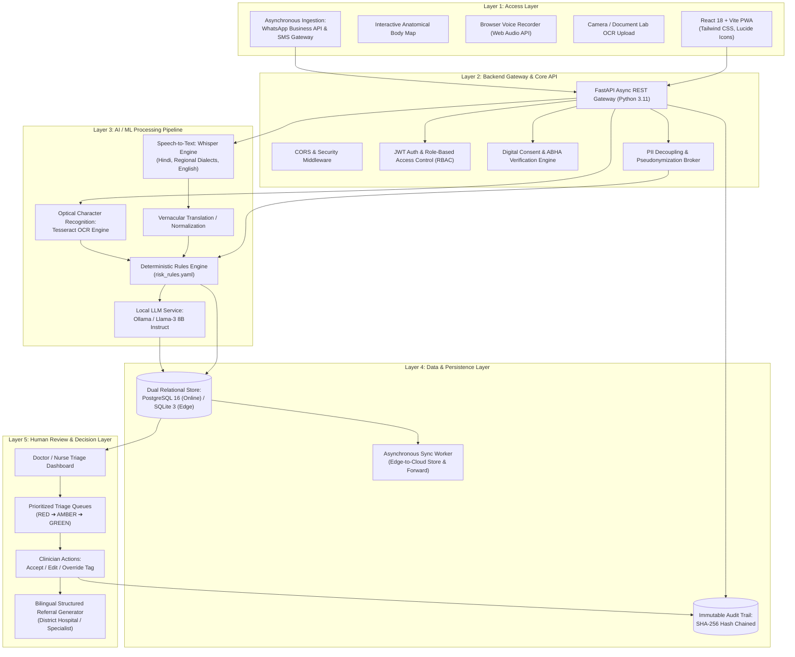
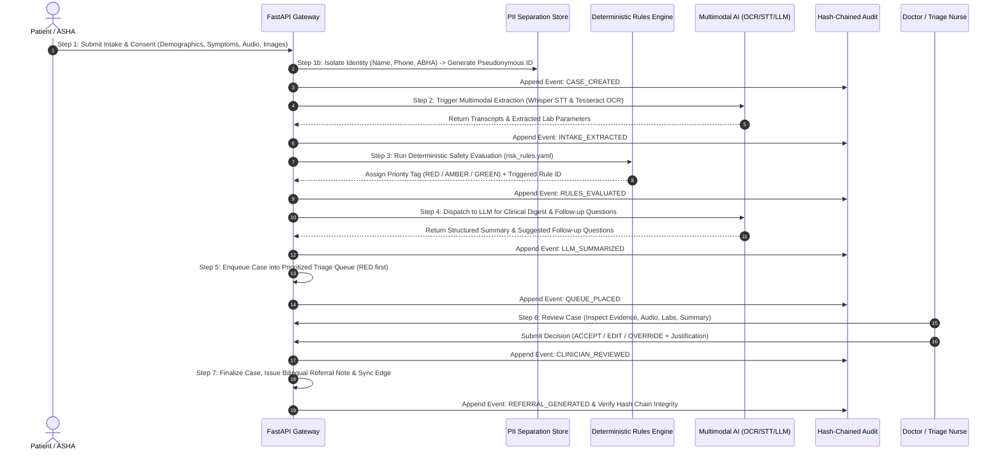
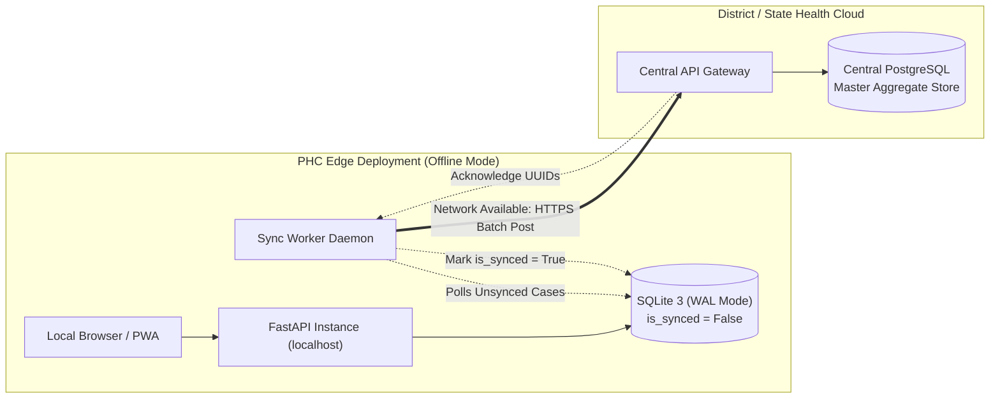

# SAHAYAK-Triage: System Architecture & Technical Specification

> **System Designation**: SAHAYAK (Smart Automated Healthcare Assistant for Yielding Actionable Knowledge & Triage)  
> **Target Environment**: Primary Health Centres (PHCs), Community Health Centres (CHCs), Sub-Centres, and Mobile Medical Units across India  
> **Operating Modes**: Cloud-Connected (PostgreSQL) and Offline Edge (SQLite with Asynchronous Synchronization)

---

## 1. Executive Summary & Design Principles

SAHAYAK-Triage is a multimodal, safety-first, human-in-the-loop clinical triage assistant engineered specifically for resource-constrained Indian public healthcare settings. Healthcare delivery in rural India faces severe clinician-to-patient imbalances, high patient volumes, diverse vernacular languages, intermittent internet connectivity, and physical paper-based records.

To address these challenges responsibly, SAHAYAK-Triage is guided by five fundamental design principles:

1. **Safety-First Determinism**: No generative AI model is permitted to make an autonomous triage classification. Deterministic clinical rules execute prior to, and independently of, generative Large Language Models (LLMs).
2. **Mandatory Human-in-the-Loop (HITL)**: All machine-assisted suggestions remain provisional until verified, modified, or overridden by an accredited Medical Officer or Triage Nurse.
3. **Multimodal Accessibility**: Accommodates illiterate or semi-literate patients and overburdened frontline workers via vernacular voice notes, interactive visual body maps, and optical character recognition (OCR) of printed diagnostic slips.
4. **Offline-First Resilience**: Designed to function completely without an active internet connection at the PHC edge node, asynchronously reconciling with central servers when connectivity restores.
5. **Strict Data Privacy & Cryptographic Accountability**: Adherence to India's Digital Personal Data Protection (DPDP) Act 2023 through decoupled Patient Identifiable Information (PII), consent verification, and an immutable SHA-256 hash-chained audit ledger.

---

## 2. Five-Layer Architecture Overview

The SAHAYAK-Triage platform is structured into five distinct operational layers, establishing clear separation of concerns, defensive security boundaries, and modular extensibility.



### Layer 1: Access Layer
Provides resilient, lightweight, touch-optimized user interfaces for healthcare providers and asynchronous community channels:
- **Responsive React 18 PWA**: Built with Vite and Tailwind CSS. Optimized for low-spec desktop terminals, Android tablets, and smartphones used by Accredited Social Health Activists (ASHA) and Auxiliary Nurse Midwives (ANM).
- **Interactive Anatomical Body Map**: Visual SVG front/back selector enabling rapid location-specific symptom logging (head, chest, abdomen, pelvis, limbs) without requiring complex typing.
- **Audio Voice Recording Interface**: Captures vernacular spoken symptom descriptions directly in the browser via standard Web Audio APIs.
- **Document Camera Capture**: High-contrast document scanner UI for capturing physical lab test slips, discharge summaries, and blood reports.
- **External Communication Webhooks**: Ingestion endpoints for Twilio SMS and Meta WhatsApp Cloud API to receive patient inquiries and send referral advisories.

### Layer 2: Backend Gateway & Core API
Orchestrates requests, secures boundaries, and isolates personal information:
- **FastAPI Core Engine**: High-performance, asynchronous REST framework utilizing Python 3.11 with native Pydantic v2 data validation.
- **Role-Based Access Control (RBAC)**: Token-based authentication using JSON Web Tokens (JWT with HS256) enforcing role privileges: `DOCTOR`, `NURSE`, and `ADMIN`.
- **Consent & Rights Enforcer**: Blocks processing if explicit patient consent is missing; supports DPDP "Right to Erasure" by scrubbing identity tables while preserving anonymized epidemiological aggregates.
- **PII Decoupling Broker**: Separates sensitive demographic identifiers (`name`, `phone`, `abha_id`) from clinical observations (`symptoms`, `vitals`, `risk_tag`), assigning random UUIDv4 pseudonymous tokens.

### Layer 3: AI/ML Processing Pipeline
Transforms unstructured multimodal clinical signals into structured, risk-stratified insights:
- **Deterministic Rules Engine (`rules_engine.py`)**: Loads safety criteria from `risk_rules.yaml`. Evaluates critical physiological thresholds (e.g., $SpO_2 < 92\%$, systolic BP $> 180$, chest pain duration $> 30$ mins, maternal hemorrhage) using pure boolean logic.
- **Speech-to-Text Service (`stt_service.py`)**: Interfaces with local OpenAI Whisper models to transcribe vernacular audio notes into Hindi, Marathi, Bengali, Tamil, Telugu, and Indian English.
- **OCR Service (`ocr_service.py`)**: Uses Tesseract OCR and OpenCV image preprocessing (thresholding, noise removal) to extract laboratory values (Hemoglobin, Platelets, Fasting Blood Sugar, Creatinine).
- **Translation & Normalization Service (`translation_service.py`)**: Standardizes vernacular anatomical terms and chief complaints into clinical English for LLM ingestion.
- **Local LLM Summarizer (`llm_service.py`)**: Communicates with Ollama running quantized models (e.g., `llama3:8b-instruct-q4`). Synthesizes concise clinical digests and recommends focused diagnostic follow-up questions. **Crucially, the LLM cannot downgrade a RED or AMBER risk level established by the Rules Engine.**

### Layer 4: Data & Persistence Layer
Ensures reliable storage, tamper-evident audit logging, and edge resilience:
- **Dual Relational Store**: PostgreSQL 16 Alpine in cloud deployments for enterprise scalability and concurrent indexing; SQLite 3 with Write-Ahead Logging (WAL) enabled in disconnected rural edge deployments.
- **Cryptographic Hash-Chained Audit Ledger**: Every case creation, OCR extraction, audio transcription, automated rule trigger, LLM summary, and clinician review produces an immutable record linked by SHA-256 hashing (`previous_hash` + payload = `current_hash`).
- **Store-and-Forward Sync Worker (`sync_worker.py`)**: Background worker monitoring network connectivity. When offline edge nodes regain connectivity, pending records (`is_synced = False`) are pushed to the central regional server with idempotent conflict resolution.

### Layer 5: Human Review & Decision Layer
Maintains clinical oversight and authoritative decision authority:
- **Prioritized Clinician Queue**: Dynamic triage dashboard sorting cases by risk priority (`RED` Emergency $\to$ `AMBER` Urgent $\to$ `GREEN` Routine), descending by wait time.
- **Clinical Review Workspace**: Allows the attending Medical Officer or Triage Nurse to inspect patient history, listen to original audio recordings, view source lab images, inspect rule-trigger justification, and view LLM summaries.
- **Decision Engine (Accept / Edit / Override)**: Clinicians can confirm the system tag, adjust the category, or override it with mandatory clinical justification notes.
- **Structured Referral Generator**: Generates formatted, printable, bilingual (English + Vernacular) referral slips for tertiary facilities, including vitals, rule red-flags, clinician notes, and transport urgency.

---

## 3. End-to-End Data Flow: The 7-Step Lifecycle

The lifecycle of an encounter through SAHAYAK-Triage proceeds through seven sequential stages:



### Detailed Step Breakdown

1. **Step 1: Consent Recording & PII Decoupling**  
   The patient or frontline health worker presents symptoms. Explicit digital consent is recorded with language and timestamp. Patient identity details (Name, Phone, Age, Gender, ABHA ID) are persisted into `patient_identities`, while clinical data is written to `cases` under a random UUID `pseudonymous_id`. An audit entry (`CASE_CREATED`) is written to the ledger.

2. **Step 2: Multimodal Signal Extraction**  
   - Audio recordings are processed by the Whisper STT service, returning vernacular transcripts and confidence scores.
   - Diagnostic report images are preprocessed with OpenCV and parsed via Tesseract OCR, extracting structured biochemical values (e.g., Blood Glucose, Hemoglobin, Platelet Count).
   - Touch-selected body map locations and textual symptom descriptors are parsed and aggregated.

3. **Step 3: Deterministic Red-Flag Triage**  
   Aggregated parameters are fed into `rules_engine.py`. The engine compares observations against `risk_rules.yaml`. If any life-threatening condition matches (e.g., $SpO_2 < 92\%$ or maternal bleeding), the case is immediately tagged as `RED` or `AMBER` with the specific rule ID (e.g., `R001`, `R002`) and explanatory message.

4. **Step 4: AI Clinical Summarization & Follow-Up Formulation**  
   With the safety tag locked, the case data is sent to the local LLM service (`llm_service.py`). The LLM constructs a standardized clinical summary (History of Presenting Illness, Key Findings, Differential Considerations) and suggests 2-3 focused follow-up questions for the triage nurse to ask the patient.

5. **Step 5: Prioritized Queue Placement**  
   The case status is transitioned to `READY_FOR_REVIEW`. The record appears on the facility's triage dashboard, dynamically ordered by severity (`RED` $\to$ `AMBER` $\to$ `GREEN`) and waiting time.

6. **Step 6: Clinician Review & Decision Auditing**  
   The Medical Officer opens the case, reviews the extracted signals, listens to the voice clip if necessary, and inspects the rule trigger. The clinician can:
   - **Accept**: Agree with the rule-based recommendation.
   - **Edit**: Adjust symptom tags or add clinical observations.
   - **Override**: Change the risk classification (e.g., downgrading or upgrading the tag) with a mandatory clinical rationale.

7. **Step 7: Structured Referral Generation & Edge Synchronization**  
   If the patient requires secondary or tertiary escalation, a structured referral document is generated with transport priority and medical summary. The sync worker marks the record for transmission if operating at an edge facility.

---

## 4. Safety-First Design: Rules Engine Before LLM

Large Language Models are probabilistic text generators susceptible to hallucinations, variable phrasing sensitivity, and subtle omission of negative findings. In emergency triage, relying on an LLM for classification poses unacceptable clinical risks.

```
Incoming Multimodal Data
       │
       ▼
┌────────────────────────────────────────────────────────┐
│      DETERMINISTIC RULES ENGINE (risk_rules.yaml)      │
│  - Zero Hallucination Risk                             │
│  - 100% Reproducible Boolean Evaluation                │
│  - Absolute Precedence over Generative Outputs         │
└────────────────────────────────────────────────────────┘
       │
       ├─► [RED / AMBER Triggered?] ───► Locks Safety Tag
       ▼
┌────────────────────────────────────────────────────────┐
│            GENERATIVE LLM (Llama-3 via Ollama)         │
│  - Restricted to Summarization & Follow-Up Synthesis   │
│  - CANNOT Downgrade Rule Severity                      │
│  - Provides Explainability, NOT Diagnosis              │
└────────────────────────────────────────────────────────┘
       │
       ▼
┌────────────────────────────────────────────────────────┐
│              HUMAN CLINICAL VERIFICATION               │
│  - Doctor/Nurse retains ultimate authority             │
└────────────────────────────────────────────────────────┘
```

### Safety Engine Mechanics
- **Rules Configuration (`risk_rules.yaml`)**: Maintained as version-controlled clinical definitions created in consultation with emergency medicine guidelines.
  - `R001 (RED)`: $SpO_2 < 92\%$ OR Chest Pain $> 30\text{ mins}$
  - `R002 (RED)`: Systolic BP $> 180\text{ mmHg}$ OR Maternal Bleeding present
  - `R003 (AMBER)`: Fever duration $\ge 3\text{ days}$ in child under 5 years
  - `R004 (AMBER)`: Symptom duration $> 72\text{ hours}$ in patient with chronic comorbidity
  - `R005 (GREEN)`: Single mild symptom $< 24\text{ hours}$ with normal vitals
- **LLM Boundary Guardrails**: The LLM's system prompt restricts its output to narrative structuring and question suggestions. The API server enforces that the final triage risk tag reflects the rules engine output unless explicitly overridden by a human doctor.

---

## 5. Offline-First Architecture: Edge Resilience in Rural PHCs

Rural Primary Health Centres frequently experience grid power failure and loss of cellular network connectivity. SAHAYAK-Triage is built to run autonomously on edge hardware (such as an in-clinic mini PC or laptop) without cloud reliance.



### Edge Operation Specifications
1. **Local SQLite Storage**: When `OFFLINE_MODE=true`, the backend automatically initializes SQLite with Write-Ahead Logging (`PRAGMA journal_mode=WAL;`), enabling concurrent reads and writes.
2. **Local AI Inference**: Tesseract OCR and Whisper run locally via on-device CPU/GPU acceleration, while Ollama executes the quantized 4-bit Llama-3 model on local hardware.
3. **Store-and-Forward Synchronization**:
   - Every case created at the edge has `is_synced = False`.
   - The `sync_worker.py` daemon periodically attempts an exponential-backoff handshake with the central regional endpoint.
   - Upon connection, pending cases and their audit chains are packaged into an encrypted JSON batch payload.
   - The central server processes records idempotently using `pseudonymous_id` deduplication. Upon receipt confirmation, the local database flags `is_synced = True`.

---

## 6. Security, Compliance & Data Integrity

### PII Separation Architecture (DPDP Act 2023 Compliance)
To prevent inadvertent leakage of patient identities to AI inference services and log aggregators, the data architecture enforces strict separation between identity and clinical observations:

```
┌─────────────────────────────────────────┐       ┌─────────────────────────────────────────┐
│     PATIENT IDENTITY TABLE (PII)        │       │       CLINICAL CASE TABLE (NON-PII)     │
├─────────────────────────────────────────┤       ├─────────────────────────────────────────┤
│ id: Integer (PK)                        │       │ id: UUID (PK)                           │
│ case_id: UUID (FK -> cases.id)          │◄─────►│ pseudonymous_id: UUID                   │
│ name: VarChar (Encrypted at Rest)       │       │ status: DRAFT / READY / REVIEWED        │
│ phone: VarChar (Encrypted at Rest)      │       │ risk_tag: RED / AMBER / GREEN           │
│ abha_id: VarChar                        │       │ symptoms_text: Text                     │
│ age_years: Integer                      │       │ vitals & lab values: JSONB              │
│ gender: VarChar                         │       │ voice_transcript: Text                  │
│ created_at: Timestamp                   │       │ llm_summary: Text                       │
└─────────────────────────────────────────┘       └─────────────────────────────────────────┘
```

- **Right to Erasure (Deletion)**: Under DPDP Act 2023, when a patient exercises their right to delete (`DELETE /api/v1/cases/patients/{id}`), their record in `patient_identities` is scrubbed immediately. The de-identified clinical data in `cases` is retained for public health epidemiology and audit continuity without any link back to the citizen's identity.

### Role-Based Access Control (RBAC)
FastAPI dependency injection enforces strict authorization tokens on all endpoints:
- **`NURSE`**: Authorized to record consent, create cases, upload voice/lab data, view queues, and verify vitals.
- **`DOCTOR`**: Authorized to perform full clinical reviews, override risk tags, sign off on referrals, and access diagnostic histories.
- **`ADMIN`**: Authorized to audit system logs, verify cryptographic chains, and manage user accounts.

### Cryptographic Hash-Chained Audit Trail
Every clinical decision in SAHAYAK-Triage must be defensible and tamper-evident. The `audit_entries` table functions as a sequential cryptographic ledger:

```
Entry N-1                             Entry N
┌──────────────────────────────┐      ┌──────────────────────────────┐
│ id: 101                      │      │ id: 102                      │
│ action: RULES_EVALUATED      │      │ action: CLINICIAN_REVIEWED   │
│ previous_hash: "a3f8...11bc" │      │ previous_hash: "7d4e...991a" │◄── (Matches Current Hash of 101)
│ current_hash:  "7d4e...991a" ├─────►│ current_hash:  "c81b...340f" │
└──────────────────────────────┘      └──────────────────────────────┘
```

#### Hash Computation Formula
$$\text{Content} = \text{JSON}(\text{detail sorted}) + \text{action} + \text{case\_id}$$
$$\text{Current Hash} = \text{SHA-256}(\text{Previous Hash} \mathbin{\Vert} \text{Content})$$

The endpoint `GET /api/v1/audit/{case_id}/verify` walks the entire linked list for any case, re-computing each SHA-256 hash from Genesis ($N=0$) to the latest entry. If any database administrator or attacker alters a prior triage tag or note in the database, the hash verification immediately reports the exact record ID where the chain was broken.
